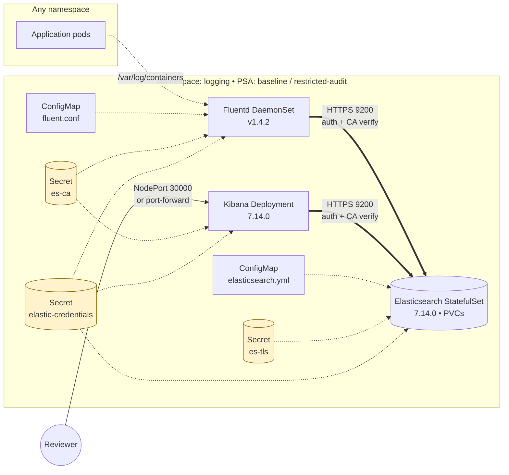

# EFK on Kubernetes

A production-leaning Elasticsearch + Fluentd + Kibana log pipeline you can run on minikube in one command, with TLS, authentication, NetworkPolicies, PodSecurity Admission, and a clean Kustomize layout that ports to EKS/GKE/AKS by switching overlays.


## Architecture



Bold edges are TLS-protected and authenticated. NetworkPolicies default-deny in the `logging` namespace and only open the edges shown above. See [docs/architecture.md](docs/architecture.md) for the longer narrative and [docs/security.md](docs/security.md) for the security model.

## Quick start (minikube)

```bash
# One-time prep
make tls-certs        # generate CA + node keystore via docker (no host tools)
make secrets          # create elastic-credentials, es-tls, es-ca in-cluster

# Deploy + verify
make up               # applies overlays/minikube
make wait             # blocks until all pods are Ready
make smoke            # end-to-end check: cluster health, logs flowing, RBAC scope

# Open Kibana
make kibana           # opens via minikube NodePort 30000
# or
make port-forward     # forwards localhost:5601 -> svc/kibana

# Show the auto-generated elastic password
make elastic-password
```

In Kibana, create an index pattern matching `logstash-*` with `@timestamp` as the time field to start querying logs.

## What gets deployed

| Component | Kind | Version | Replicas (minikube / cloud) | Exposure |
|---|---|---|---|---|
| Elasticsearch | StatefulSet + 2 Services + PDB | 7.14.0 | 1 / 3 | ClusterIP (TLS) |
| Kibana | Deployment + Service | 7.14.0 | 1 / 1 | NodePort 30000 / ClusterIP |
| Fluentd | DaemonSet + RBAC | v1.4.2-debian-elasticsearch-1.1 | per node | none (egress only) |

All resources land in the `logging` namespace.

## Prerequisites

- **kubectl** ≥ 1.25 (Kustomize built-in)
- **Docker** (used by `make tls-certs` to run `elasticsearch-certutil`; nothing else to install)
- **minikube** ≥ 1.32 (or any k8s cluster; cloud overlay below)
- **openssl** (for generating the `elastic` password — usually preinstalled)
- ~3 GB RAM available to your cluster

## Configuration

Two overlays:

```
overlays/minikube/   # single ES replica, discovery.type: single-node, 5Gi PVC,
                     # Kibana NodePort 30000, PDB maxUnavailable: 1
overlays/cloud/      # 3 ES replicas + podAntiAffinity, 20Gi PVC, ClusterIP Kibana,
                     # storageClassName guidance per cloud
```

Switch with `OVERLAY=cloud make up`. For cloud, edit [overlays/cloud/patches/es-statefulset.yaml](overlays/cloud/patches/es-statefulset.yaml) to set the right `storageClassName` (`gp3` for EKS, `pd-ssd` for GKE, `managed-csi` for AKS) and front Kibana with your own Ingress.

To inspect what will be applied before applying:

```bash
kubectl kustomize overlays/minikube | less
```

### Secrets

Three Secrets are generated locally (never committed):
- `elastic-credentials` — `password` (24-char random) + `xpack_encryptionkey` (32-char random)
- `es-tls` — PKCS12 keystore + CA, mounted only into Elasticsearch
- `es-ca` — CA only, mounted into Kibana + Fluentd (least privilege)

Templates live at [base/secrets/*.example.yaml](base/secrets/) so reviewers can see the schema.

## Security model

- **Transport TLS** between ES nodes (port 9300) and **HTTP TLS** on the REST API (port 9200), enforced via `xpack.security.transport.ssl` and `xpack.security.http.ssl`. Kibana and Fluentd verify the server cert against the bundled CA.
- **Authentication**: the built-in `elastic` superuser, password set via the `ELASTIC_PASSWORD` env from the `elastic-credentials` Secret. (Single-user model — limitation acknowledged in [docs/security.md](docs/security.md).)
- **RBAC**: Fluentd's ServiceAccount has a narrowly-scoped ClusterRole (`get/list/watch` on `pods` and `namespaces` only — verified by `make smoke`).
- **NetworkPolicies** (default-deny per pod selector):
  - ES: ingress 9200 from kibana+fluentd; ingress 9300 from other ES pods.
  - Kibana: ingress 5601 (toggleable to ingress-ns); egress 9200 + DNS.
  - Fluentd: egress 9200 + DNS; no ingress.
- **PodSecurity Admission**: namespace labeled `enforce=baseline` (permits the `vm.max_map_count` privileged init container ES needs), with `audit=restricted` and `warn=restricted` so the gap is observable. See [docs/security.md](docs/security.md) for the alternative sysctl-DaemonSet pattern.

## Troubleshooting

See [docs/troubleshooting.md](docs/troubleshooting.md) for the cookbook. Common ones:

- **ES pod CrashLoopBackOff** with `max virtual memory areas vm.max_map_count [...]` → the `increase-vm-max-map` init container failed. Confirm the namespace has `pod-security.kubernetes.io/enforce: baseline` (not `restricted`).
- **PVC stuck Pending** on minikube → enable a default StorageClass: `minikube addons enable default-storageclass`.
- **Kibana stuck at "Kibana server is not ready yet"** → CA mount or password mismatch. `kubectl -n logging logs deploy/kibana | tail -50` will say which.
- **No logs in Kibana** → in **Stack Management → Index Patterns**, create pattern `logstash-*` with timestamp field `@timestamp`.

## Known limitations / roadmap

- **Elasticsearch 7.14 reached EOL in 2022.** Kept here deliberately to keep the demo on the original pinned versions; production should be on 8.x or [ECK](https://www.elastic.co/elastic-cloud-kubernetes).
- **Fluentd v1.4.2 is from 2019.** A drop-in bump to `fluent/fluentd-kubernetes-daemonset:v1.14-debian-elasticsearch7-1.0` keeps ES 7.x compatibility and picks up newer Ruby/OpenSSL.
- **Single `elastic` superuser** is shared by ES bootstrap, Kibana, and Fluentd. Per-component users with custom roles are a natural next step.
- **TLS cert rotation is manual** — 7.14 doesn't hot-reload keystores. The rotation procedure is in [docs/security.md](docs/security.md).
- **No CI** — `make validate` is the local equivalent. Adding `kubeval` + a kind-based smoke job is a future improvement.

## License

[MIT](LICENSE).
