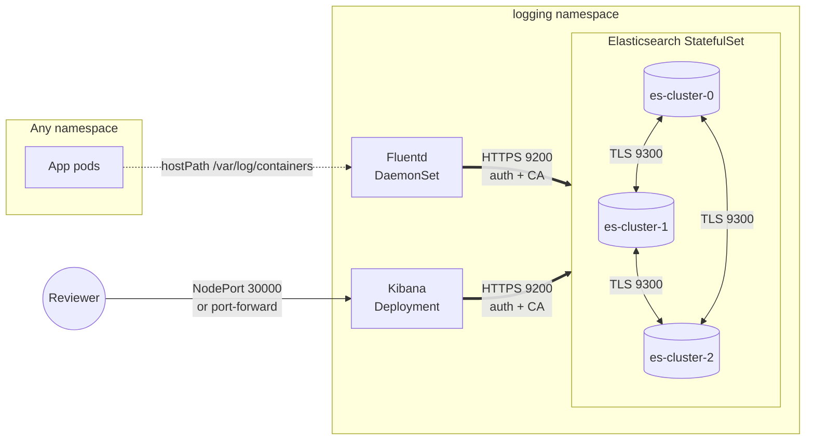

# Architecture

## Data flow

## Component responsibilities

**Fluentd** runs as a DaemonSet so every node has a collector. It tails `/var/log/containers/*.log` (mounted via `hostPath`), enriches each line with Kubernetes metadata (pod, namespace, labels) using the image-provided `kubernetes.conf`, and ships to Elasticsearch over HTTPS. The custom `fluent.conf` ConfigMap overrides the image's default to add `ca_file` verification and a `monitor_agent` source on port 24220 that the readiness/liveness probes hit. A `<match>` rule drops logs from the `logging` namespace itself so Fluentd doesn't tail its own output and create a feedback loop.

**Elasticsearch** runs as a StatefulSet with a headless governing Service (`elasticsearch`, for pod DNS) and a separate ClusterIP Service (`elasticsearch-client`, for stable VIP that clients use). The `elasticsearch.yml` ConfigMap enables xpack security and configures TLS on both the transport layer (node-to-node, port 9300) and the HTTP layer (REST, port 9200), referencing a PKCS12 keystore mounted from the `es-tls` Secret. The `ELASTIC_PASSWORD` env (sourced from the `elastic-credentials` Secret) bootstraps the built-in `elastic` superuser on first boot. The `increase-vm-max-map` init container sets `vm.max_map_count=262144` (required by ES) and is the one place we knowingly run privileged.

**Kibana** is a single-replica Deployment that talks to ES via the client Service over HTTPS, authenticates as `elastic`, and verifies the CA mounted from the `es-ca` Secret (CA-only, not the full keystore — least privilege). Probes hit `/api/status`. The minikube overlay exposes the Service as NodePort 30000; the cloud overlay leaves it ClusterIP and expects an Ingress in front.

## Trust boundaries

- `es-tls` (Secret) holds the PKCS12 keystore and is mounted **only** into Elasticsearch pods. ES is the only thing that needs the private key.
- `es-ca` (Secret) holds the CA cert only and is mounted into Kibana + Fluentd so they can verify ES's server cert without ever having access to ES's key material.
- `elastic-credentials` (Secret) holds the `elastic` user password and the Kibana xpack encryption key. All three pods mount it.
- NetworkPolicies enforce that **only** Kibana and Fluentd can reach ES port 9200, and **only** ES pods can reach each other on port 9300.

## Why two ES services?

- `elasticsearch` is headless (`clusterIP: None`) — required by the StatefulSet for pod DNS (`es-cluster-0.elasticsearch`, etc.). It's the governing service.
- `elasticsearch-client` is a normal ClusterIP — what Kibana and Fluentd target. The stable VIP avoids client-side DNS caching surprises when the StatefulSet scales and survives a single pod restart without re-resolving.

## Overlays

- `overlays/minikube/` patches replicas to 1, sets `discovery.type: single-node`, allocates 5 Gi per PVC, exposes Kibana via NodePort 30000, and relaxes the PDB to `maxUnavailable: 1` so single-replica drains aren't blocked.
- `overlays/cloud/` keeps the 3-replica base, adds zone-aware podAntiAffinity (with hostname fallback), bumps PVCs to 20 Gi, and leaves Kibana as ClusterIP for Ingress fronting. The `storageClassName` is commented with cloud-specific examples (`gp3`, `pd-ssd`, `managed-csi`).
